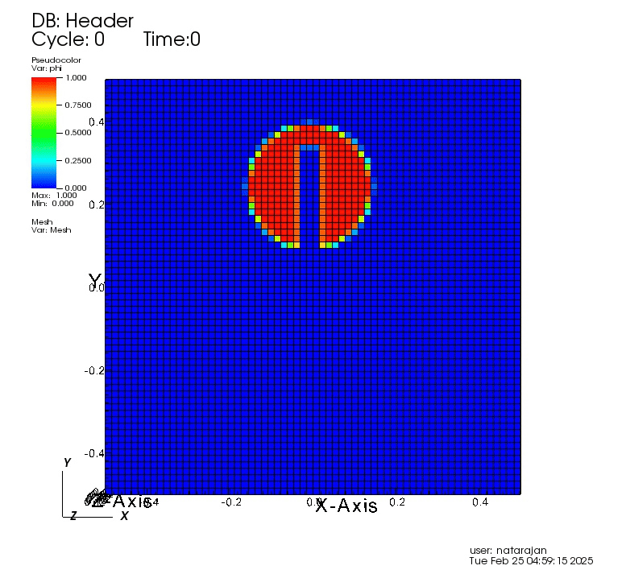
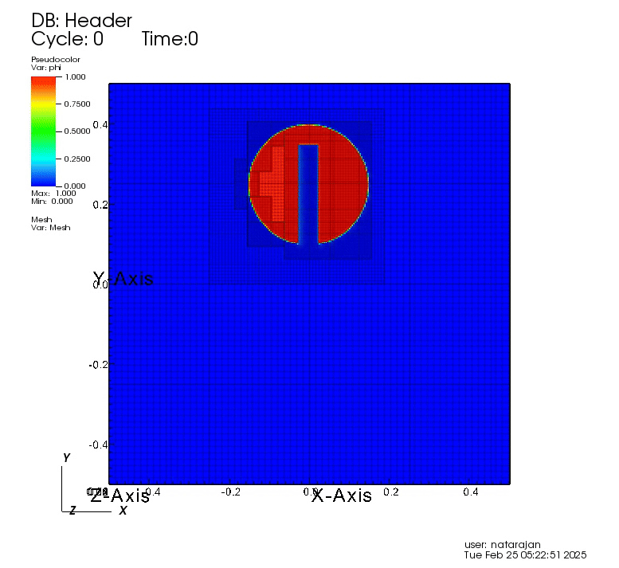

# Zalesak Disk Advection with AMReX

This repository provides an example of the **Zalesak disk test case** using the **AMReX framework** for advection simulations.

```sh
git clone --recursive https://github.com/AMReX-Codes/amrex.git
cd amrex/Tutorials
git clone --recursive https://github.com/nataraj2/amrex-tutorials.git
cd amrex-tutorials/
git checkout zalesak_disk
cd ExampleCodes/Amr/Advection_AmrCore/Exec
make -j8
mpirun -np 4 main3d.gnu.MPI.ex inputs



```
